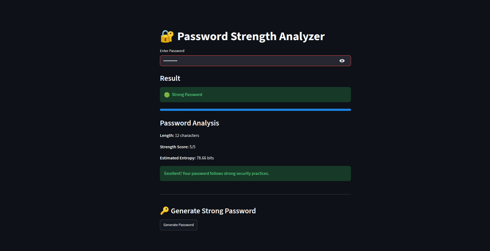

# 🔐 Password Strength Analyzer

A Streamlit-based cybersecurity tool that evaluates password strength using multiple security checks and provides recommendations for creating stronger passwords.

## 📌 Features

- ✅ Password Length Validation
- ✅ Uppercase Letter Detection
- ✅ Lowercase Letter Detection
- ✅ Number Detection
- ✅ Special Character Detection
- ✅ Password Strength Scoring
- ✅ Password Entropy Estimation
- ✅ Common Password Detection
- ✅ Strong Password Suggestions
- ✅ Random Strong Password Generator
- ✅ Interactive Web Interface

---

## 🛠 Technologies Used

- Python
- Streamlit
- Regular Expressions (re)
- Math Module
- Random Module

---

## 📷 Project Preview



---

## 🚀 Installation

Clone the repository:

```bash
git clone https://github.com/irfanahmed0019/password-strength-analyzer.git
```

Navigate to the project directory:

```bash
cd password-strength-analyzer
```

Install dependencies:

```bash
pip install -r requirements.txt
```

Run the application:

```bash
streamlit run app.py
```

---

## 📊 Password Evaluation Criteria

The application evaluates passwords based on:

- Length (8+ characters)
- Uppercase letters (A-Z)
- Lowercase letters (a-z)
- Numbers (0-9)
- Special characters (!@#$%^&*)

It then classifies the password as:

- 🔴 Weak
- 🟡 Medium
- 🟢 Strong

---

## 🔒 Security Features

- Detects commonly used insecure passwords
- Calculates estimated password entropy
- Provides actionable recommendations
- Generates secure random passwords

---

## 📁 Project Structure

```text
password-strength-analyzer/
│
├── app.py
├── requirements.txt
├── README.md
└── demo.png
```

---

## 👨‍💻 Author

**Irfan Ahmed**

GitHub: https://github.com/irfanahmed0019

---

## ⭐ Future Improvements

- Password history tracking
- Breached password database integration
- Password export functionality
- Advanced entropy visualization
- Multi-language support
